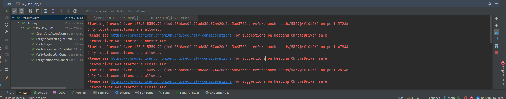

1. Test Case Can we run by Testng.xml file 

2. TestNG Result

3. Page Object are store in com.inetbanking.pageObjects
4. All the test case can be run under TestCases.
5. Selenium 4.0.0 Is used for running test case
6. Default browser is chrome
7. mvn clean run for running via CMD
8. Extend Report can we find under/test-output 
